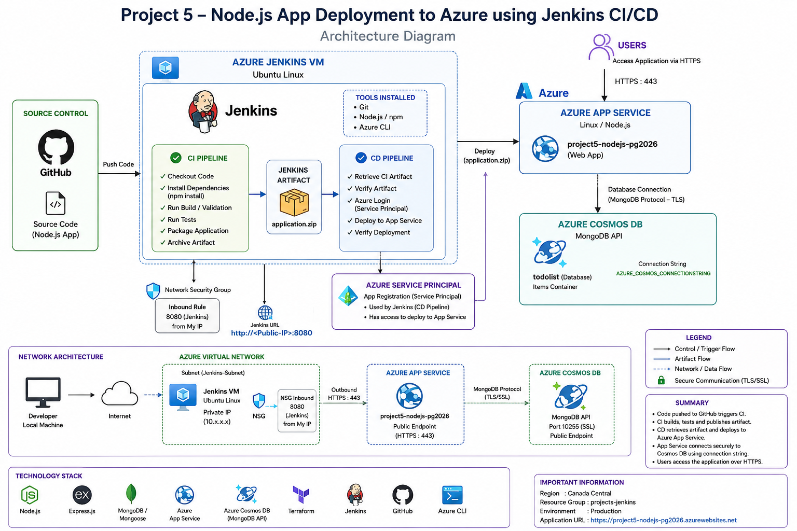

# Project 5 – Node.js + MongoDB Application Deployment to Azure using Jenkins CI/CD

## Project Overview

This project demonstrates an end-to-end DevOps workflow for deploying a Node.js Todo application to Microsoft Azure.

The application uses **Node.js, Express.js and Mongoose**. Azure infrastructure is provisioned with **Terraform**, the application is hosted on **Azure App Service**, **Azure Cosmos DB with MongoDB API** provides the cloud database, and **Jenkins** provides separate Continuous Integration (CI) and Continuous Deployment (CD) pipelines.

The source application is based on the Azure Samples `msdocs-nodejs-mongodb-azure-sample-app` project.

## Architecture Diagram



### Architecture Flow

```text
Developer
   |
   v
GitHub Repository
   |
   v
Azure Ubuntu VM - Jenkins
   |
   +--> CI Pipeline
   |      - Checkout source
   |      - Install dependencies
   |      - Build / validate
   |      - Run basic tests
   |      - Package application
   |      - Archive application.zip
   |
   +--> Jenkins Artifact: application.zip
   |
   +--> CD Pipeline
          - Retrieve CI artifact
          - Verify artifact
          - Authenticate to Azure
          - Deploy artifact
          - Verify deployment
                    |
                    v
             Azure App Service
                    |
                    v
        Azure Cosmos DB (MongoDB API)
```

## Network Architecture

The Jenkins server runs on an **Ubuntu Azure VM** inside an Azure virtual network. Jenkins is accessed through the VM's public endpoint on port **8080**, controlled by the VM Network Security Group (NSG).

The deployed application is exposed through the public HTTPS endpoint provided by Azure App Service. Jenkins uses Azure CLI and Service Principal credentials during the CD pipeline to deploy the application artifact to App Service.

The Node.js application connects to Azure Cosmos DB using the App Service environment setting:

```text
AZURE_COSMOS_CONNECTIONSTRING
```

No database credentials are hard-coded into the application source code or committed to GitHub.

> **Note:** This project does not claim Private Endpoint or App Service VNet Integration for the application-to-database path because those components were not configured as part of this implementation.

## Technology Stack

| Technology | Purpose |
|---|---|
| Node.js | Application runtime |
| Express.js | Web application framework |
| Mongoose | MongoDB object modelling / database access |
| GitHub | Source-code repository |
| Jenkins | CI/CD automation |
| Terraform | Infrastructure as Code |
| Azure CLI | Azure authentication and deployment commands |
| Azure VM | Hosts Jenkins |
| Azure App Service | Hosts the Node.js application |
| Azure Cosmos DB | MongoDB-compatible cloud database |
| Azure Service Principal | Jenkins-to-Azure authentication |

## Azure Infrastructure

Terraform was used to provision the main application infrastructure.

The Terraform configuration is stored in:

```text
terraform/
├── main.tf
├── variables.tf
├── terraform.tfvars
├── outputs.tf
└── .terraform.lock.hcl
```

The infrastructure includes:

- Azure Resource Group
- Linux App Service Plan
- Linux Web App
- Azure Cosmos DB account using MongoDB API
- MongoDB database

The Jenkins Ubuntu VM and its supporting networking resources provide the CI/CD execution environment.

### Terraform Workflow

```bash
terraform init
terraform fmt
terraform validate
terraform plan
terraform apply
```

Terraform successfully provisioned the application resources and returned the Azure Web App hostname.

## Local Application Validation

Before deployment, the Node.js application was tested locally.

Dependencies were installed with:

```bash
npm install
```

The application was started using:

```bash
npm start
```

The application was then verified through the local web interface before moving to Azure deployment.

## Azure Cosmos DB

The local application initially required a MongoDB connection. For the Azure environment, **Azure Cosmos DB with MongoDB API** was provisioned.

The MongoDB database used by the application is:

```text
todolist
```

The Cosmos DB connection string is stored in Azure App Service configuration as:

```text
AZURE_COSMOS_CONNECTIONSTRING
```

The application reads the setting using:

```javascript
process.env.AZURE_COSMOS_CONNECTIONSTRING
```

This separates application configuration and secrets from source code.

## Jenkins Server

Jenkins was installed on an Ubuntu VM in Azure.

The VM was prepared with the tools required for the pipelines:

- Git
- Node.js
- npm
- Azure CLI
- Jenkins

Jenkins runs as a system service on the VM.

## Continuous Integration (CI)

The CI Jenkins job is:

```text
project5-ci
```

The CI pipeline performs the following workflow:

1. Checks out the application source code.
2. Installs Node.js dependencies.
3. Performs build/validation steps.
4. Runs the available/basic tests.
5. Packages the application.
6. Creates `application.zip`.
7. Archives the ZIP as a Jenkins build artifact.

The successful CI build therefore produces a reusable deployment artifact instead of rebuilding the application during CD.

## Jenkins Build Artifact

The deployment package produced by CI is:

```text
application.zip
```

The successful CD run confirmed that Jenkins retrieved the artifact from `project5-ci` and verified it before deployment.

This implements the important DevOps principle:

```text
Build Once -> Deploy the Same Artifact
```

## Continuous Deployment (CD)

The CD Jenkins job is:

```text
project5-cd
```

The CD pipeline contains these stages:

### Retrieve CI Artifact

The **Copy Artifact** Jenkins plugin retrieves `application.zip` from the successful CI build.

### Verify Artifact

Jenkins verifies that the ZIP package exists before proceeding.

### Azure Login

Jenkins authenticates to Azure using an Azure Service Principal.

The Service Principal values are stored using Jenkins Credentials rather than directly in the pipeline.

Credential IDs include:

```text
azure-client-id
azure-client-secret
azure-tenant-id
```

### Deploy to Azure App Service

After successful authentication, Jenkins deploys `application.zip` to the previously provisioned Azure Linux Web App.

### Verify Deployment

The pipeline verifies the deployed application. The final CD build completed successfully.

## Azure Service Principal

A dedicated Azure Service Principal was created for Jenkins.

Its purpose is to allow the Jenkins CD pipeline to authenticate non-interactively with Azure and deploy to the required Azure resources.

The pipeline uses:

```bash
az login --service-principal
```

Sensitive values are stored in Jenkins Credentials and masked in Jenkins console output.

## Final CI/CD Workflow

```text
GitHub
   |
   v
project5-ci
   |
   +-- Checkout
   +-- npm install
   +-- Build / Validate
   +-- Test
   +-- Package
   |
   v
application.zip
   |
   v
Jenkins Archived Artifact
   |
   v
project5-cd
   |
   +-- Copy Artifact
   +-- Verify Artifact
   +-- Service Principal Login
   +-- Deploy
   +-- Verify
   |
   v
Azure App Service
   |
   v
Node.js Todo Application
   |
   v
Azure Cosmos DB
(MongoDB API)
```

## Deployment Verification

The final application was successfully deployed to Azure App Service and the Todo application loaded from the Azure-hosted endpoint.

The project evidence also includes:

- Local application running successfully
- Terraform configuration and successful provisioning
- Azure resource view
- Azure Service Principal creation
- Jenkins service running on the Azure VM
- Jenkins dashboard
- Successful `project5-cd` build
- Live Todo application hosted on Azure

## Issues Encountered and Resolutions

### 1. Missing MongoDB URI

**Issue:** The application initially reported that the Mongoose URI was undefined.

**Resolution:** A MongoDB connection was configured for local testing, followed by Azure Cosmos DB with MongoDB API for the cloud environment.

### 2. Azure VM SKU Availability / Quota

**Issue:** The initially selected VM SKU was unavailable or had insufficient quota in the selected Azure region.

**Resolution:** Available VM SKUs were checked and a supported VM configuration was selected.

### 3. App Service Free Tier and `always_on`

**Issue:** Terraform reported that `always_on = true` could not be used with the F1 App Service SKU.

**Resolution:**

```hcl
always_on = false
```

was configured.

### 4. Cosmos DB Regional Capacity

**Issue:** Cosmos DB provisioning in Canada Central encountered Azure regional capacity restrictions.

**Resolution:** The Cosmos DB deployment configuration/location was adjusted so the account could be provisioned successfully.

### 5. Jenkins Copy Artifact

**Issue:** The CD pipeline initially could not use `copyArtifacts`.

**Resolution:** The Jenkins **Copy Artifact** plugin was installed and the CD job was configured to retrieve the CI artifact.

### 6. Jenkins Azure Credential ID

**Issue:** Azure Login initially failed because the Jenkins credential expected by the pipeline was missing/incorrect, and later the Client ID value was empty.

**Resolution:** The Service Principal values were stored as Jenkins credentials using the exact IDs expected by the pipeline.

The Azure Login stage then completed successfully.

## Security Considerations

- Azure Service Principal credentials are stored in Jenkins Credentials.
- Jenkins masks secrets in pipeline output.
- The Cosmos DB connection string is stored as an Azure App Service application setting.
- Secrets are not intentionally committed to GitHub.
- Terraform state and `.terraform/` provider files should not be committed because state can contain sensitive infrastructure information.
- Jenkins VM access should be restricted with appropriate NSG rules.
- The production application is accessed through HTTPS.

## Repository Notes

The repository should ignore Terraform runtime/state files such as:

```gitignore
terraform/.terraform/
terraform/*.tfstate
terraform/*.tfstate.*
```

The provider lock file may remain version controlled:

```text
terraform/.terraform.lock.hcl
```

## Key Learning Outcomes

This project demonstrates practical experience with:

- Infrastructure as Code using Terraform
- Azure App Service provisioning
- Azure Cosmos DB with MongoDB API
- Jenkins installation and administration
- Separate Jenkins CI and CD jobs
- Node.js dependency installation and packaging
- Jenkins artifact publishing and retrieval
- Azure Service Principal authentication
- Jenkins Credentials management
- Azure CLI deployment
- Environment-based secret configuration
- Troubleshooting Azure quota, Terraform and Jenkins pipeline issues
- End-to-end application deployment verification

## Result

The final solution provides an end-to-end deployment path:

**GitHub → Jenkins CI → Jenkins Artifact → Jenkins CD → Azure App Service → Azure Cosmos DB**

The Node.js Todo application is successfully hosted on Azure, while Terraform manages the application infrastructure and Jenkins automates the build and deployment workflow.

---

## Project Evidence / Screenshots

The implementation document contains screenshots demonstrating:

1. Local Todo application validation.
2. Terraform configuration files and successful Azure provisioning.
3. Azure resources created for the project.
4. Azure Service Principal creation.
5. Jenkins installed and running on the Ubuntu VM.
6. Jenkins dashboard access.
7. Successful Jenkins CD pipeline.
8. Final Node.js Todo application running on Azure App Service.

> For GitHub, place individual screenshot files under a folder such as `docs/screenshots/` and reference them from this section. This avoids committing a Word document solely to display screenshots.
